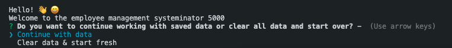

# Unit-12-MySQL-Homework-Employee-Tracker
   

## Application Demo
[YouTube]( https://youtu.be/WVO7O_66rsw)

## Description
Keep track of your vital business information.

## Project Goals:
- Create, Read, and Update MySQL data
- Ask questions with Inquirer
- Sanitize SQL commands to avoid SQL injection

## Skills Learned
- [Inquirer](https://www.npmjs.com/package//inquirer)
- [Node.js](https://developer.mozilla.org/en-US/docs/Glossary/Node.js?utm_campaign=feed&utm_medium=rss&utm_source=developer.mozilla.org)
- [MySQL2 NPM](https://www.npmjs.com/package/mysql2)
- [MySQL](https://www.mysql.com/)
## Resources
- [Node.js Documentation](https://nodejs.org/en/docs/)
- [Inquirer](https://www.npmjs.com/package//inquirer)
- [MySQL](https://dev.mysql.com/doc/refman/8.0/en/)
- **General Reference ->** [MDN](https://developer.mozilla.org/en-US/)
